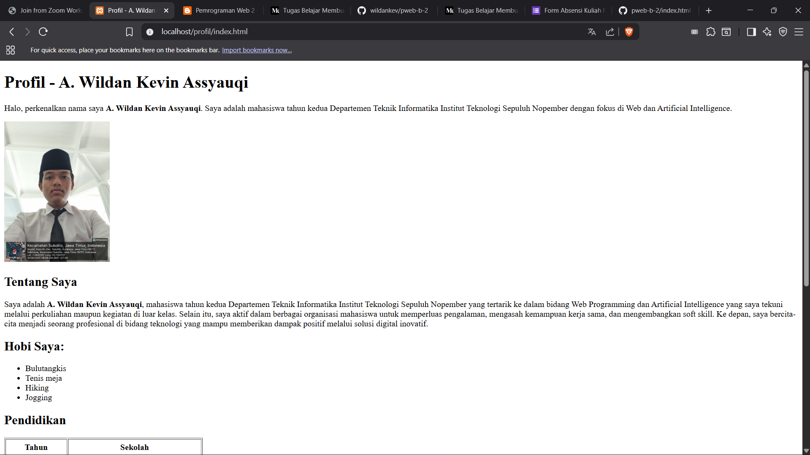
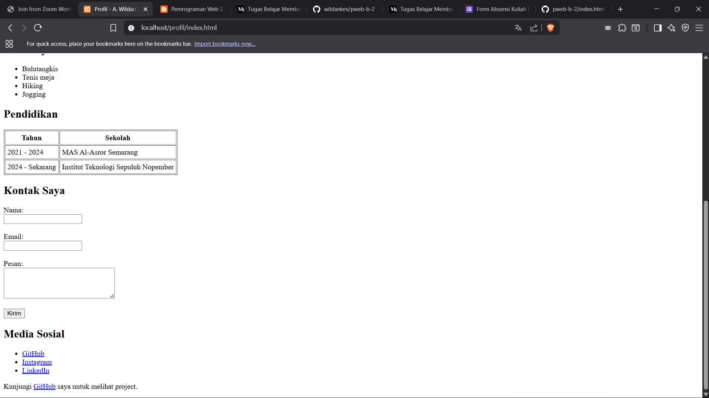

# Tugas 2 - Pemrograman Web B

## Deskripsi
Assalamualaikum Wr. Wb., pada kuliah pertemuan kedua dalam kelas Pemrograman Web Kelas B 
Saya ditugaskan untuk membuat HTML dengan kriteria berikut:

- Judul profil (heading)
- Paragraf deskripsi diri
- Foto profil (image)
- Daftar hobi (list)
- Tabel riwayat pendidikan
- Form kontak sederhana
- Link ke media sosial

## Preview

Kode dapat diakses melalui link berikut :  
[https://github.com/wildankev/pweb-b-2/blob/main/index.html](https://github.com/wildankev/pweb-b-2/blob/main/index.html)

## Identitas
- **Nama**: A. Wildan Kevin Assyauqi  
- **NRP**: 5025241265  
- **Kelas**: Pemrograman Web - B
